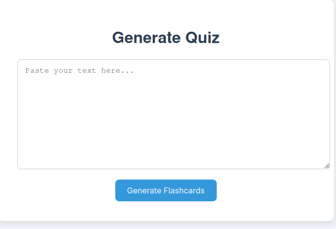
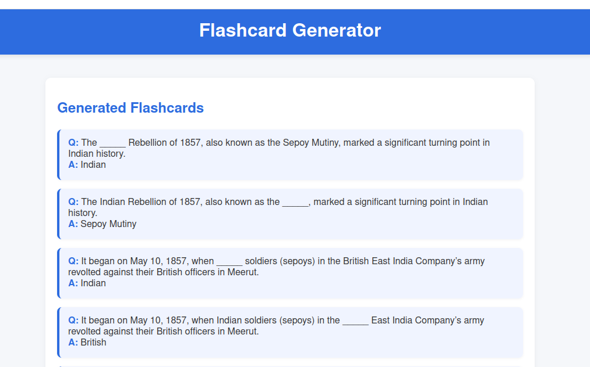
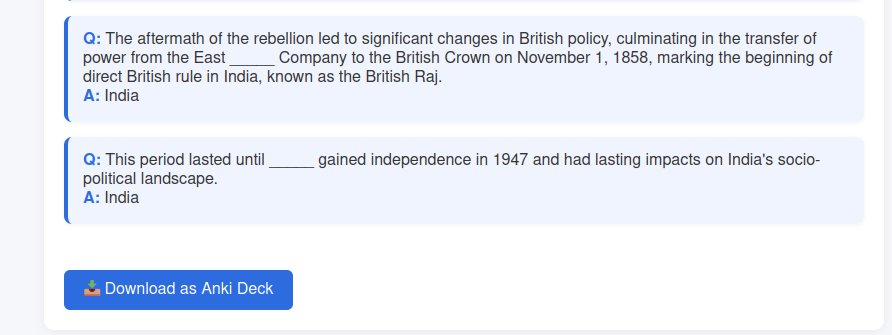

# 🧠 AI-Powered Flashcard & Quiz Generator

Transform plain text into intelligent, fill-in-the-blank flashcards using Natural Language Processing.  
Perfect for students, educators, autodidacts, and lifelong learners.

Built with `Flask` + `NLTK`, styled with love — and exports directly to Anki.


---

## ✨ Features

- 🎯 Uses **Named Entity Recognition (NER)** to extract key concepts
- ✍️ Generates **cloze-style flashcards** (fill-in-the-blank)
- 📤 **Export to Anki** (`.apkg`) for spaced repetition
- ⚡ Clean, minimalist, and responsive UI (HTML + CSS or React + Tailwind)
- 🧩 Fully local & open-source — no data leaves your machine

---

## 🖼️ Screenshots

### 🏠 Home Page
Paste your text to get started  


### 📋 Flashcards View
Preview the generated flashcards  


### ⬇️ Export
One-click to download as an Anki deck  


---

## 🧠 How It Works

1. ✏️ Paste a paragraph or set of notes.
2. 🧠 App runs **Named Entity Recognition** using NLTK.
3. 🧩 Replaces named entities with blanks to create question-answer pairs.
4. 🎴 Preview in browser or **export to Anki** for serious study.

---

## 🚀 Getting Started

### 🧰 Backend (Flask)

```bash
git clone https://github.com/yourusername/flashcard-generator.git
cd flashcard-generator/backend
python -m venv venv
source venv/bin/activate  # or venv\Scripts\activate on Windows
pip install -r requirements.txt
python app.py

```

## 📦 Export to Anki

You can download the generated flashcards as a .apkg file that works directly with Anki, the most popular spaced repetition software.


---

## 🧠 Example

Input:

> Albert Einstein was born in Ulm, Germany in 1879.


Output:

> Q: _____ was born in Ulm, Germany in 1879.
A: Albert Einstein


---

## ⚖️ License

This project is licensed under the MIT License.
Feel free to use, modify, and share!


---
